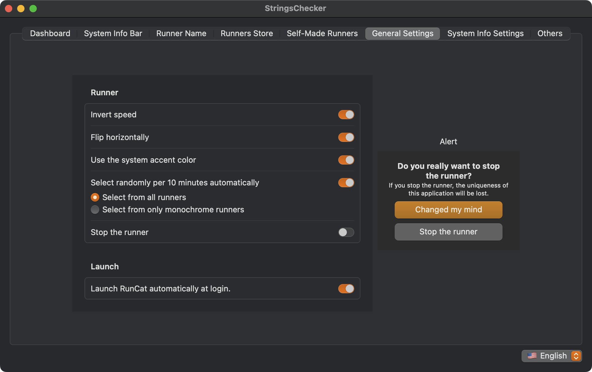
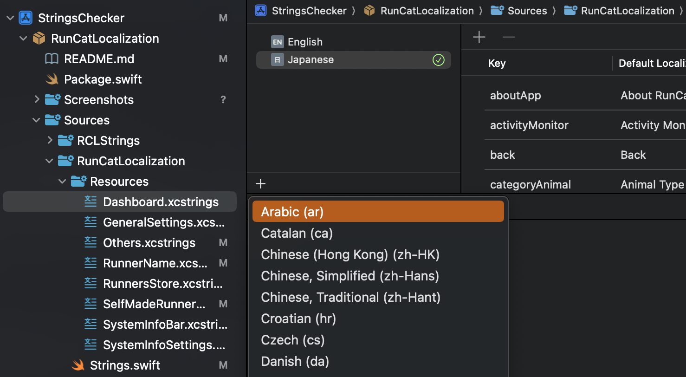
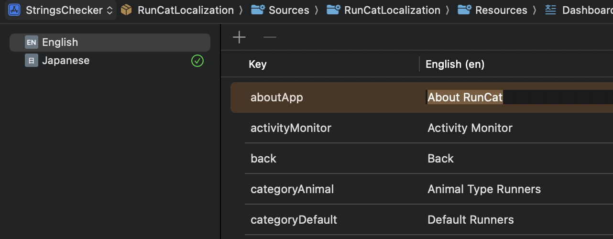
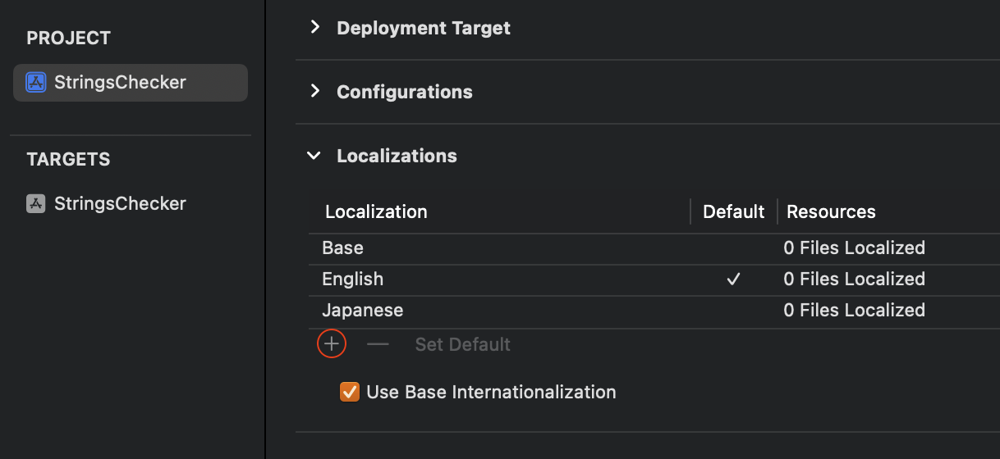

# RunCatLocalization

Manage RunCat localization srtings.

RunCat uses [SystemInfoKit](https://github.com/Kyome22/SystemInfoKit), so localization of this library is also required.

## Supported languages

- English (primary)
- Japanese
- Korean

## Requirements

- Development with Xcode 16.2+
- Written in Swift 6.0
- Compatible with macOS 14.0+

## Check Strings with GUI

First, run the shell script below.

```sh
$ sh generate-strings.sh
$ open StringsChecker/StringsChecker.xcodeproj
```

Build & Run StringsChecker project.



## How to Contribute

1. Edit Sources/RunCatLocalization/RCLLanguage.swift  
   ```diff swift
   public enum RCLLanguage: String, Sendable, Identifiable {
       case automatic
       case english = "en"
       case japanese = "ja"
       case korean = "ko"
   +   case newLanguage = "new language code"

       ︙
   
       public var label: String {
           switch self {
           case .automatic: ""
           case .english: "🇺🇸 English"
           case .japanese: "🇯🇵 日本語"
           case .korean: "🇰🇷 한국어"
   +       case .newLanguage = "🏁 New Language"
           }
       }
   
       public static let allCases: [RCLLanguage] = [
           .english,
           .japanese,
           .korean,
   +       .newLanguage
       ]
   }
   ```
2. Add Locale to xcstrings files in Sources/RunCatLocalization/Resources  
   
3. Edit those xcstrings files  
   
4. Add Locale to StringsChecker Target  
   

## LICENSE

Apache License Version 2.0
